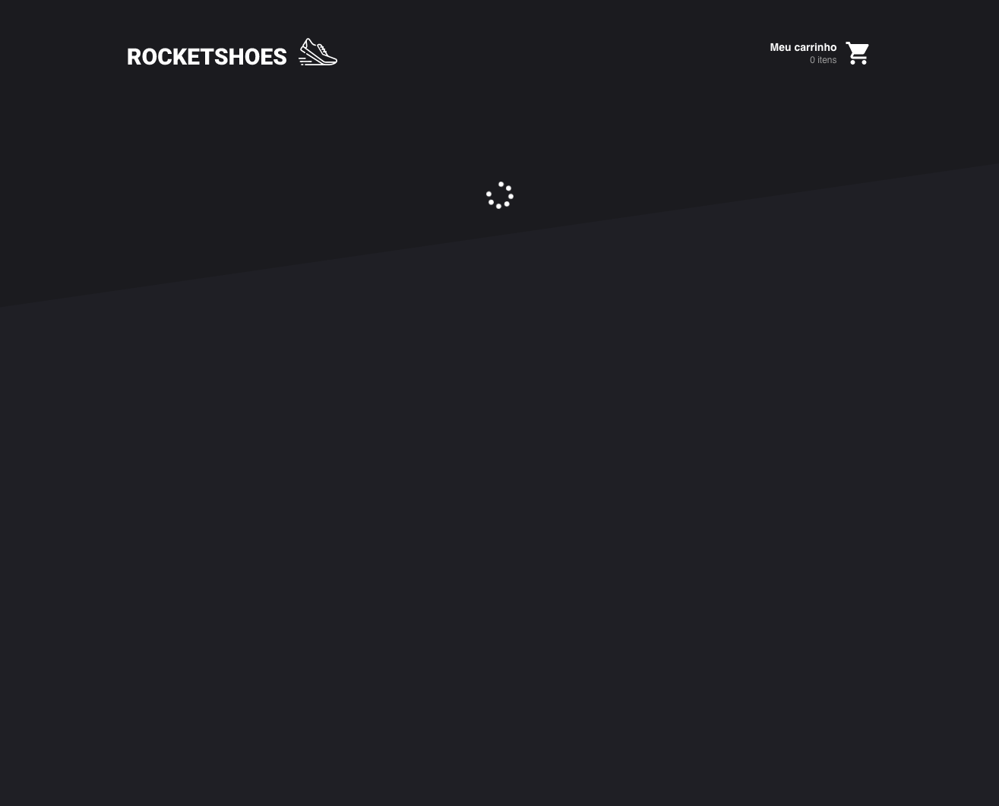
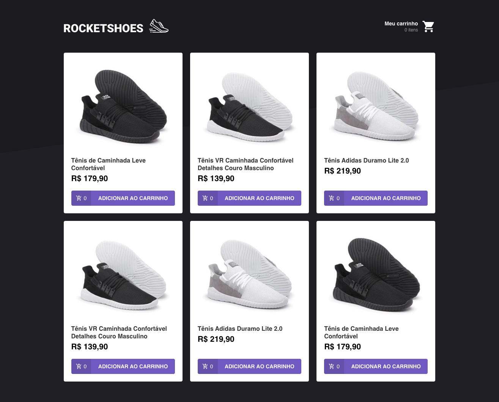
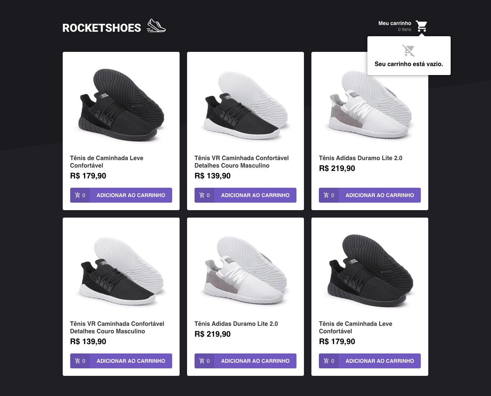
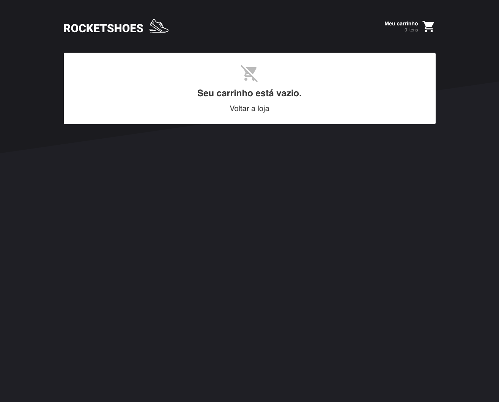
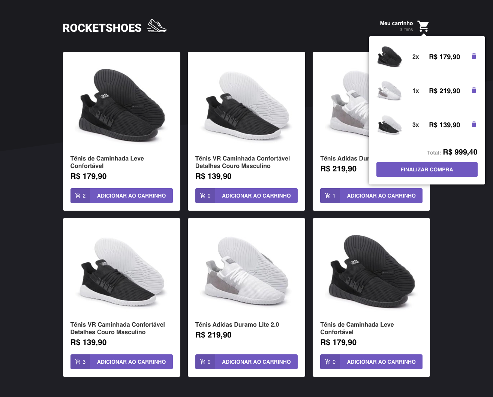
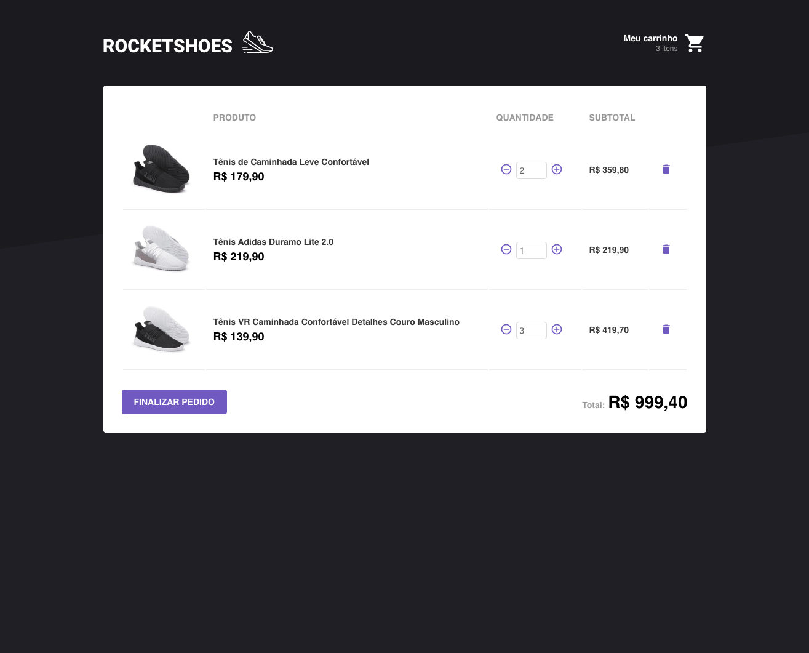

<h1 align="center">
    
</h1>

<h3 align="center">
  Módulo 07
</h3>

## :rocket: Arquitetura Flux

Nesse projetos desenvolvemos uma aplicação web utulizando ReactJS e a arquitetura Flux.

Essa aplicação consiste em uma listagem de produtos e adição ao carrinho de compras da empresa fictícia Rocketshoes.
Foram feitas diversas validações, como por exemplo se a quantidade adicionada está em estoque e não ser possível colocar uma quantidade menor que 1 no carrinho.

O carrinho de compras tem as funcionalidade de edição de quantidade, cálculo de subtotal e total e remoção do produto.

## :hammer: Para criação dessa aplicação utilizamos as seguintes ferramentas:
- [ReactJS](https://pt-br.reactjs.org/docs/getting-started.html)
- [Redux](https://redux.js.org/introduction/getting-started)
- [Redux Saga](https://github.com/redux-saga/redux-saga)
- [Styled Components](https://styled-components.com/)
- [Axios](https://github.com/axios/axios)
- [Reactotron](https://github.com/infinitered/reactotron)
- [React Icons](https://react-icons.netlify.com/#/)
- [Immer](https://github.com/immerjs/immer)
- [JSON Server](https://github.com/typicode/json-server#getting-started)

## :computer: Resultado:

### Carregando enquanto a requisição acontece

### Home

### Box do carrinho vazio

### Carrinho vazio

### Box do carrinho com produtos

### Carrinho com produtos

### Erro quantidade fora de estoque

